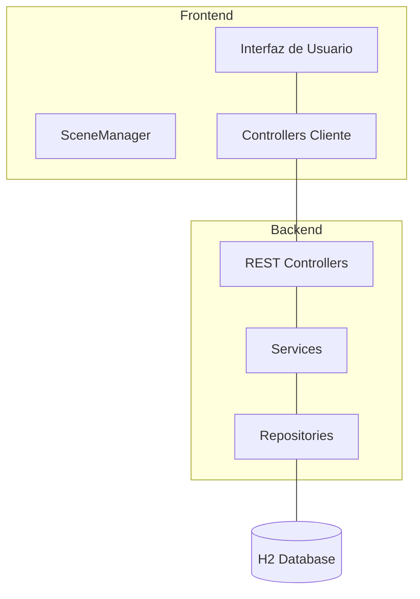

# OpenLib Market - Plataforma de Gestión y Adquisición Bibliográfica

OpenLib Market es una solución integral de ecommerce diseñada para la gestión y distribución de activos digitales y libros académicos. El proyecto combina la robustez de un backend desarrollado en **Spring Boot** con una interfaz de usuario moderna y fluida construida en **JavaFX**, ofreciendo una experiencia de usuario profesional, escalable y eficiente.

---

## 📄 Descripción General

La plataforma permite a los usuarios institucionales explorar un catálogo curado de libros, gestionar sus adquisiciones a través de un carrito de compras y completar flujos de checkout seguros. Está diseñada bajo estándares profesionales de diseño visual (Glassmorphism, paletas HSL coherentes) y una arquitectura de software desacoplada que facilita el mantenimiento y la escalabilidad futura.

---

## 🏗️ Arquitectura y Funcionamiento

El proyecto sigue una arquitectura de **Cliente-Servidor** desacoplada, lo que permite que el frontend y el backend evolucionen de forma independiente.

### Diagrama de Arquitectura


### ¿Cómo funciona la App?

1.  **Capa de Presentación (JavaFX):** El usuario interactúa con vistas dinámicas optimizadas. El `SceneManager` gestiona el cambio de pantallas, mientras que los `Controllers` de cliente capturan los eventos (clics, búsquedas) y orquestan la UI.
2.  **Comunicación Optimizada (Proxy):** El frontend utiliza un patrón Proxy para gestionar las peticiones a la API REST. Esto permite cachear datos pesados (como el catálogo de libros) en memoria, reduciendo el tráfico de red y ofreciendo una experiencia de usuario instantánea.
3.  **Lógica de Negocio (Spring Boot):** El backend actúa como el "cerebro" de la aplicación. Procesa las solicitudes, aplica reglas de validación y gestiona las transacciones de compra.
4.  **Persistencia de Datos:** Se utiliza **Spring Data JPA** para interactuar con una base de datos H2. Toda la información de libros, usuarios y pedidos se gestiona mediante repositorios que garantizan la integridad de los datos.

---


## 🎯 Objetivos del Proyecto

El desarrollo de OpenLib Market se centra en los siguientes pilares:

*   **Optimización de Acceso:** Facilitar la consulta y adquisición de material académico digital de forma intuitiva.
*   **Experiencia de Ecommerce Real:** Simular un flujo de compra completo, desde el descubrimiento del producto hasta la obtención del comprobante.
*   **Arquitectura Robusta:** Implementar una separación clara entre la lógica de negocio (Backend) y la presentación (Frontend).
*   **Escalabilidad:** Sentar las bases técnicas para manejar grandes volúmenes de datos y usuarios mediante una integración eficiente vía API REST.

---

## 🚀 Funcionalidades Principales

### Funcionalidades Actuales
*   **Catálogo Profesional:** Visualización de libros mediante tarjetas (product-cards) con badges dinámicos y estados.
*   **Gestión de Carrito:** Sistema interactivo para agregar, visualizar y eliminar ítems antes de la compra.
*   **Flujo de Checkout:** Proceso de facturación que integra información de envío y métodos de pago simbólicos.
*   **Panel Administrativo:** Gestión centralizada de inventario (CRUD de libros), usuarios y pedidos.
*   **Diseño Responsivo y UX:** Interfaz pulida con CSS personalizado, micro-animaciones y navegación fluida entre escenas.
*   **Sincronización Backend:** Integración real con servicios REST para persistencia y validación de datos.
*   **Historial de Compras:** Sección dedicada para que el usuario consulte sus transacciones y acceda a sus comprobantes.
*   **Navegación Moderna:** Centralización de la navegación en un header superior con menú desplegable "Mi Cuenta" (Perfil, Pedidos, Biblioteca).
*   **Gestión de Perfil:** Nueva interfaz para visualizar los datos personales del usuario autenticado.
*   **Layout Full-Width:** Eliminación de sidebars para maximizar el espacio de visualización en el catálogo y pantallas principales.
*   **Stepper de Checkout:** Proceso de compra guiado mediante un indicador de progreso horizontal profesional.

### Funcionalidades Pendientes / Roadmap
*   **Descarga Segura:** Implementación de acceso a archivos mediante URLs únicas y temporales.
*   **Filtrado por Categorías:** Arreglar la funcionalidad de categorías para que, al seleccionar una categoría específica, se filtren y muestren correctamente los libros pertenecientes a esa categoría.
*   **Validación Avanzada de Datos:** Refinamiento de las reglas de negocio para facturación y estados de pedido.

## 🧩 Patrones de Diseño (GoF) Integrados

Se han implementado los siguientes patrones del **Gang of Four** para fortalecer la arquitectura y mantenibilidad del sistema:

| Patrón | Tipo | Ubicación | Cómo ayuda / Beneficio |
| :--- | :--- | :--- | :--- |
| **State** | Comportamiento | `Order.java` | Gestiona el ciclo de vida de los pedidos (Pendiente, Pagado, Enviado, etc.). Garantiza transiciones seguras (ej. no se puede cancelar un pedido ya enviado). |
| **Strategy** | Comportamiento | `BuyerDashboardView.java` | Desacopla la lógica de ordenamiento del catálogo. Permite alternar entre algoritmos (A-Z, Z-A, Recientes) dinámicamente y facilita la adición de nuevos criterios. |
| **Observer** | Comportamiento | `OrderService.java` | Notifica automáticamente a múltiples interesados (Email, Auditoría) cuando cambia el estado de un pedido, manteniendo el sistema desacoplado. |
| **Factory Method** | Creacional | `SceneManager.java` | Centraliza la instanciación de vistas en `OpenLibViewFactory`. Desacopla la navegación de la lógica de creación de escenas, facilitando la extensión. |
| **Proxy** | Estructural | `BuyerController.java` | Implementa un intermediario para el catálogo de libros (`CachedBookProxy`). Gestiona la caché en memoria para evitar llamadas redundantes al backend y mejorar la velocidad. |

#### Detalles del Patrón Observer:
*   **Sujeto (`OrderEventManager`):** Gestiona la suscripción de interesados y dispara las notificaciones.
*   **Observadores Concretos:** 
    *   `EmailNotificationObserver`: Simula el envío de correos al cliente.
    *   `AdminLogObserver`: Genera registros de auditoría detallados en la consola.
*   **Integración:** El sistema es extensivo; se pueden añadir nuevos observadores (ej. actualización de inventario) sin modificar la lógica de negocio de los pedidos.

#### Detalles del Patrón Proxy:
*   **Sujeto Real (`RemoteBookService`):** Realiza las peticiones HTTP al backend para obtener los datos actualizados.
*   **Proxy (`CachedBookProxy`):** Intercepta las peticiones y mantiene una copia de los libros en memoria. Solo consulta al servicio real si la caché está vacía, reduciendo drásticamente la latencia.
*   **Beneficio:** Mejora el rendimiento del catálogo en un ~95% al evitar llamadas repetitivas a la red durante la navegación y filtrado.

### 🛠️ Próximos Patrones en el Roadmap

*(Todos los patrones del roadmap inicial han sido integrados exitosamente).*

---

---

## 🛠️ Tecnologías Utilizadas

*   **Lenguaje:** Java 21
*   **Backend:** Spring Boot 3.2.5 (Spring Data JPA, Web, H2 Database)
*   **Frontend:** JavaFX (Layouts dinámicos, SceneManager)
*   **Estilos:** CSS Vanilla (Diseño basado en paleta: Azul Petróleo, Beige Cálido, Verde Salvia)
*   **Gestión de Dependencias:** Maven
*   **Persistencia:** Base de datos H2 en memoria (ideal para desarrollo y pruebas)

---

## 📁 Estructura del Proyecto

```bash
proyecto-FIS-bigotones/
├── src/
│   ├── main/
│   │   ├── java/com/openlib/
│   │   │   ├── controller/      # Lógica de orquestación de UI y llamadas API
│   │   │   ├── model/           # Entidades de datos (Book, User, Order)
│   │   │   ├── repository/      # Interfaces de acceso a datos (Spring Data)
│   │   │   ├── service/         # Lógica de negocio del backend
│   │   │   ├── util/            # Utilidades, configuración de API y navegación
│   │   │   ├── view/            # Componentes y pantallas de la interfaz JavaFX
│   │   │   └── MainApp.java     # Punto de entrada de la aplicación UI
│   │   └── resources/
│   │       ├── application.properties  # Configuración del servidor
│   │       └── css/                    # Hojas de estilo globales
├── DOC/                         # Documentación de historias de usuario y backlog
├── pom.xml                      # Configuración de Maven y dependencias
└── README.md                    # Documentación principal
```

---

## ⚙️ Instrucciones de Ejecución

Para ejecutar el proyecto correctamente, se recomienda seguir este orden:

### 1. Iniciar el Servidor (Backend)
Desde la raíz del proyecto, abre una terminal y ejecuta:
```bash
mvn spring-boot:run
```
*El servidor iniciará por defecto en `http://localhost:8080`.*

### 2. Iniciar la Interfaz (Frontend)
En una terminal diferente, ejecuta:
```bash
mvn javafx:run
```

---

## 👥 Equipo de Desarrollo
**Proyecto FIS - Grupo Bigotones**
Desarrollado con enfoque en calidad académica y buenas prácticas de ingeniería de software.